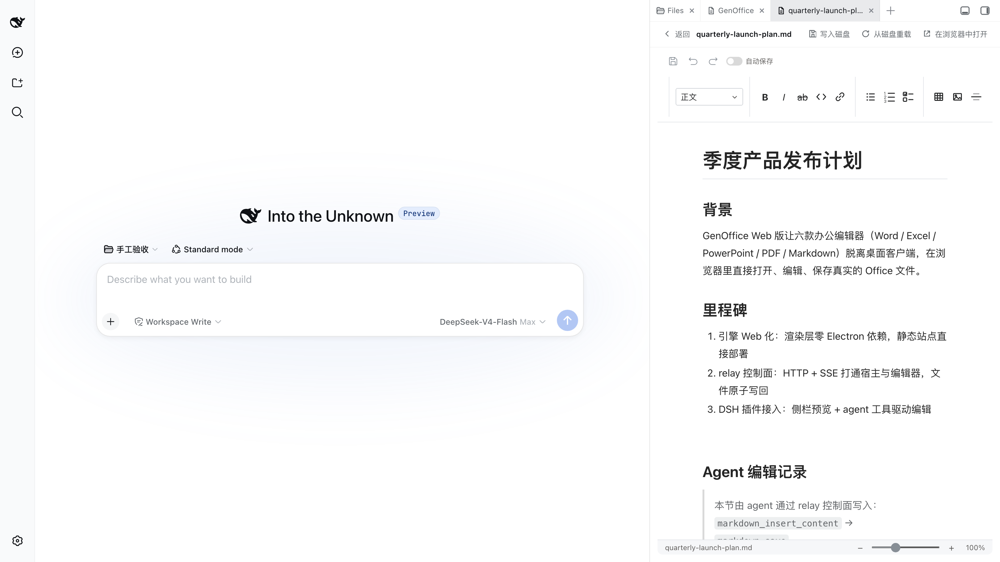
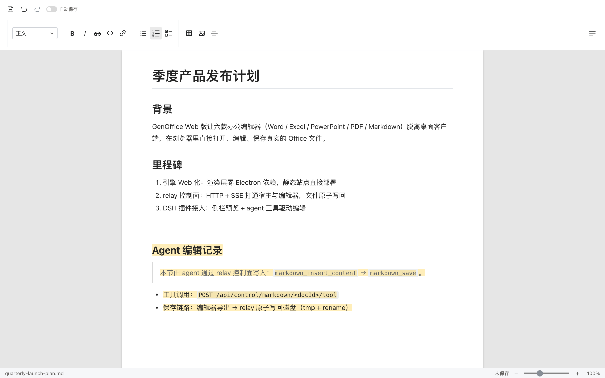

# dsh-genoffice

> **状态：实验性（experimental）· 维护中** · 适配 DSH `@deepseek-ai/dsh@0.1.2-rc.1`（平台包 `@deepseek-ai/dsh-*@0.1.2-rc.1`）+ `dsh-better-sidebar@0.18.0`（optional peer `^0.18.0`）。接口与契约仍在演进，随时可能变化。

把 [GenOffice](https://github.com/genspark-ai/genoffice)（开源 AI Office 套件）接进 DSH：侧栏文件浏览、五族文档（`docx` / `xlsx` / `pptx` / `pdf` / `md`）网页预览编辑，以及 **agent 工具驱动的文档编辑与保存**——DSH 里的 agent 可以直接调用 `docx_*` / `markdown_*` / `xlsx_*` / `pptx_*` / `pdf_*` 工具族读写真实的 Office 文件。

两仓一产品：

| 仓 | 角色 |
|---|---|
| 本仓 `dsh-genoffice` | **插件半边**：DSH 侧栏插件（`packages/tab-genoffice`）+ 跨侧契约（`contracts/`）+ 启动/冒烟脚本。结合 engine 与 `dsh-better-sidebar` 做成 DSH 插件 |
| [`dsh-genoffice-engine`](https://github.com/Nothing1024/dsh-genoffice-engine) | **上游半边**：魔改 GenOffice 引擎——web 端脱离 Electron 跑通、relay（`web/server.mjs`，:8787）、控制面 API 与 agent 工具执行器 |

## 截图（真实运行）

DSH 侧栏里的 GenOffice 页签：文件浏览 + 预览编辑 + 「写入磁盘」控制模式工具栏。文档末尾的「Agent 编辑记录」一节就是 agent 通过控制面写入后保存到磁盘的：



引擎侧 markdown 编辑器中同一次 agent 编辑（高亮为本次插入内容）：



## 工作原理

```text
DSH（:3080，better-sidebar 页签）
  │  iframe 预览 / 控制模式（control=1）
  ▼
relay（engine web/server.mjs，:8787，默认仅 loopback）
  │  /api/dir /api/file        文件浏览与原子写回
  │  /api/control/*  + SSE     控制面：宿主 → 编辑器工具调用
  ▼
GenOffice web 编辑器（docs / markdown / sheets / slides / pdf）
```

- 插件 host 把控制面封装成 DSH 工具（docx 11 + markdown 5 + xlsx 13 + pptx 39 + pdf 21，全表见 [`contracts/control-api.md`](contracts/control-api.md)）。
- 编辑工具只改编辑器内状态；写回仅由显式动作触发（tab「写入磁盘」按钮或 `*_save` 工具），经 relay `POST /api/file` 原子写回（tmp + rename，mtime 冲突校验）。
- 安全边界：relay 与控制面默认只绑 loopback；绝对路径读写仅限本机来源。

## 快速开始

> **只想先看编辑器本体？** 不需要 DSH：只 clone [engine 仓](https://github.com/Nothing1024/dsh-genoffice-engine)，`npm install && npm run web`，浏览器打开 `http://127.0.0.1:8787/` 即可（六款编辑器的 Web 版）。下面是接入 DSH 的完整路径。

前置：Node ≥ 22、pnpm；两仓并列 clone（本仓与 engine 同级，目录名任意，下例用 `plugin/` 与 `engine/`）。

```sh
git clone https://github.com/Nothing1024/dsh-genoffice.git plugin
git clone https://github.com/Nothing1024/dsh-genoffice-engine.git engine
```

```sh
# 1. 构建引擎 web-dist 并起 relay（:8787）
cd engine
npm install
npm run web            # 构建 shell/docs/markdown 并启动 relay；其余 app 按需 npm run web:build -w @genoffice/<app>

# 2. 构建插件
cd ../plugin
pnpm install
pnpm run build
pnpm test

# 3. 装配并启动 DSH 调试实例（loopback :3080，profile `go`）
sh env/setup.sh
sh env/boot.sh
```

打开 `http://127.0.0.1:3080`，右侧抽屉「+」添加 GenOffice 页签即可浏览/预览文件。`env/boot.sh` 会导出 `DSH_GENOFFICE_ROOT`，之后侧栏在 relay 未启动时会显示「启动 relay」一键拉起（host 路由 `GET/POST /dsh-artifact/genoffice-relay`）。

> `env/` 是仓内自带的 loopback `DSH_HOME` 配方（凭据、sessions、storages 均不进 git）。不要提交凭据。

## 让 AI 帮你装（复制给你的 AI 助手）

不想手动折腾的话，把下面这段整体复制给任意能执行命令的 AI 编码助手（Cursor / Claude Code / DSH agent 等），它会替你装好并演示：

```text
你是我的装机助手。请把 GenOffice 的 DSH 插件整套在我机器上跑起来并验证。要求逐步执行、每步核对成功再继续，失败先排查：

1. 环境检查：需要 Node ≥ 22、pnpm、git，缺什么先装。
2. 在同一个目录下并列 clone 两个仓：
   git clone https://github.com/Nothing1024/dsh-genoffice.git plugin
   git clone https://github.com/Nothing1024/dsh-genoffice-engine.git engine
3. 构建引擎并启动 relay：cd engine && npm install && npm run web
   验证：curl -s http://127.0.0.1:8787/api/health 应返回 "ready":true。
4. 构建插件：cd ../plugin && pnpm install && pnpm run build && pnpm test（测试应全绿）。
5. 启动 DSH 调试实例：sh env/setup.sh && sh env/boot.sh（loopback :3080；若 3080 被占用，先停掉占用进程再启动）。
6. 冒烟验证：node scripts/dev.mjs smoke 应全部通过。
7. 教我使用：打开 http://127.0.0.1:3080，右侧抽屉「+」添加 GenOffice 页签，演示浏览目录、
   预览一个 .md 或 .docx 文件，并解释「写入磁盘 / 从磁盘重载」按钮和 agent 工具族
   （docx_* / markdown_* / xlsx_* / pptx_* / pdf_* 与各族 *_save）分别是干什么的。
8. 演示 agent 编辑闭环：按仓内 README「真实案例」一节，在 /tmp 新建一个测试 markdown，
   通过控制面完成 insert_content 插入内容并 export 写回，最后展示磁盘文件的变化。

约束：所有服务只绑 127.0.0.1，不要用 --lan 或对外网暴露；不要修改我的 ~/.dsh 主目录；
平台包版本以仓内钉死的为准（@deepseek-ai/dsh@0.1.2-rc.1），不要装 latest。
```

## 真实案例：agent 通过控制面编辑并保存

上面截图的产生方式（relay 与编辑器页打开后）：

```sh
# 1. 算 docId（sha256(绝对路径)）
curl -s -X POST localhost:8787/api/control/open \
  -H 'Content-Type: application/json' -d '{"path":"/tmp/demo.md"}'

# 2. 浏览器打开控制模式编辑器（iframe 即注册执行器）
#    http://127.0.0.1:8787/markdown/?control=1&open=path%3A%2Ftmp%2Fdemo.md

# 3. 工具调用（编辑器内 skill 工具名；DSH 侧由插件映射为 markdown_insert_content）
curl -s -X POST localhost:8787/api/control/markdown/<docId>/tool \
  -H 'Content-Type: application/json' \
  -d '{"call":{"id":"demo-1","name":"insert_content","input":{"afterIndex":5,"markdown":"## Agent 编辑记录\n……"}}}'

# 4. 导出并原子写回磁盘
curl -s -X POST localhost:8787/api/control/markdown/<docId>/export \
  -H 'Content-Type: application/json' -d '{"path":"/tmp/demo.md"}'
```

冒烟基线（43 项契约断言，含五族工具名镜像核对）：

```sh
node scripts/dev.mjs smoke
```

## 目录

```text
.
├── packages/tab-genoffice/   # @deepseek-ai/dsh-tab-genoffice（侧栏页签 + host 工具）
├── contracts/                # 跨侧契约：relay-api / control-api / events（单一事实源）
├── scripts/dev.mjs           # status / start-relay / smoke / open
├── standards/                # dsh-community-standard v0.15 对齐面（见下）
├── skill/genoffice-preview/
├── docs/                     # 活文档 + 历史任务包
└── env/                      # loopback DSH_HOME 配方（配方进 git；凭据/会话不进）
```

## 社区标准对齐（standards/）

对齐 [dsh-community-standard](https://github.com/oh-my-dsh/dsh-community-standard) v0.15（社区 Draft，非官方标准）的静态声明面：`packages/tab-genoffice/dsh-plugin.json` 是标准 manifest（与官方装载用的 `dsh.plugin.json` 并存），`standards/` 内有部署 Host Descriptor、纯函数协商、fixtures 与上游触点基线。私有坐标用 `x-nothing1024.*` 命名空间，待上游 Registry 定案后做映射替换。

```sh
npm run standard:check   # manifest 校验 → facet 装载检查 → 协商 → fixtures → adapter 审计
```

已知缺口按上游 RFC 记账（client facet 受 RFC 0002 限制暂不可声明等），详见 [`standards/README.md`](standards/README.md)。

## 已知限制

- **实验性质**：契约、工具名、manifest 坐标均可能随上游（DSH 与 dsh-community-standard）演进而变化。
- 平台包版本钉死（见顶部状态行），不要 `latest`。
- relay 是部署级外部进程依赖（超出插件-宿主契约范围），由 `scripts/dev.mjs` 与侧栏「启动 relay」降级路径兜底。
- 默认仅 loopback；不要在未理解 `GENOFFICE_WEB_OPEN_PATHS` 语义前对外网开放。

## 调试

网关内部状态可用 RPC 直查（示例）：`pluginInventory/list` 看装配、`session.history` 看会话。改插件后重建并重启实例（浏览器按 boot rev 缓存）。
